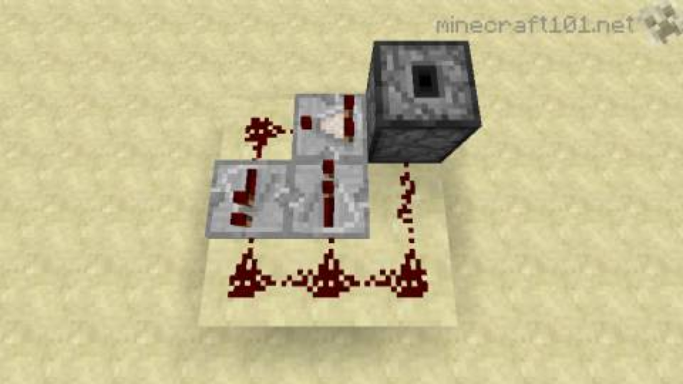
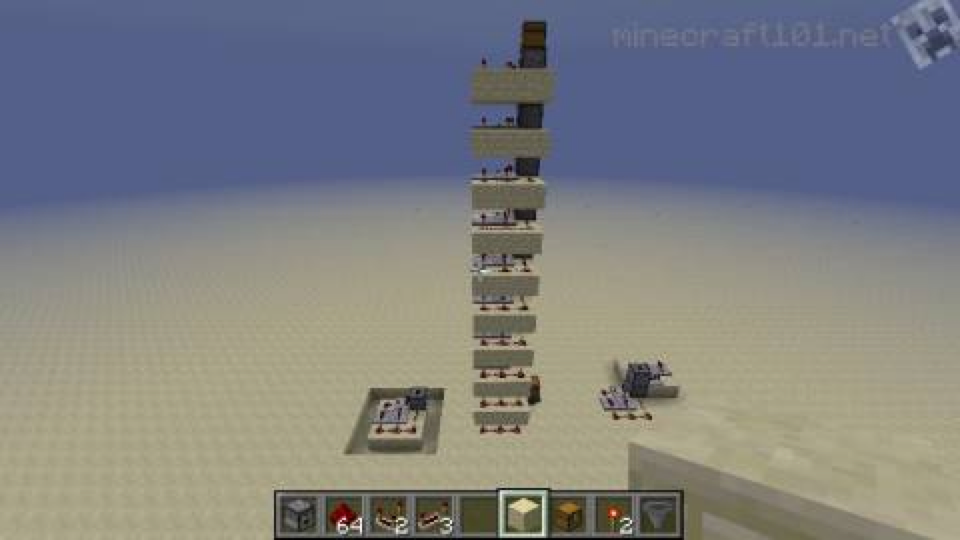

:hardbreaks:
= 마인크래프트 아이템 이동

== 아래, 옆으로 이동
깔때기

== 위로 이동
=== 드로퍼(공급기)와 물엘리베이터 (영혼모래)

=== 드로퍼(공급기)를 아래로 향하게해서 탑만들기 - dropper elevator

https://tgd.kr/s/ch1ckenkun/16432624

https://minecraft.fandom.com/ko/wiki/%EA%B3%B5%EA%B8%89%EA%B8%B0[공급기]
조약돌 7, 레드스톤 가루 1

공급기가 활성화되면, 2 레드스톤 틱(4 게임틱, 0.2초) 후 아이템을 배출. 활성화 되었을 때 한번만 배출하니

==== References
===== http://www.minecraft101.net/redstone/dropper-elevator.html[Dropper Item Elevator]

This simple 3x3x2 subunit can be stacked as high as you like.

